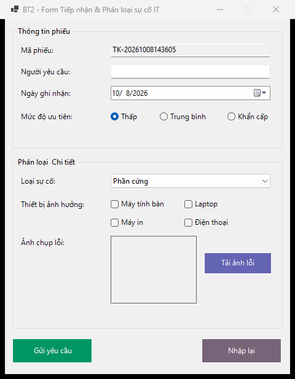
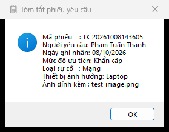
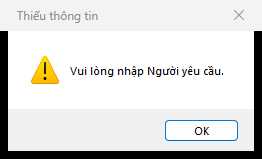

# BÁO CÁO BÀI TẬP / ĐỒ ÁN

## THÔNG TIN SINH VIÊN

- **Họ và tên:** Phạm Tuấn Thành
- **Mã số sinh viên:** 24810320264
- **Lớp:** [Chờ xác nhận lớp]
- **Tên môn học:** Lập trình C# / Windows Forms
- **Tên bài tập:** Bài 2 — Form Tiếp nhận & Phân loại sự cố IT

## MÔ TẢ BÀI TẬP

Form thu thập thông tin phiếu hỗ trợ IT, phân loại sự cố và hiển thị bản tóm tắt yêu cầu.

- Mã phiếu tự sinh, người yêu cầu, ngày ghi nhận bằng DateTimePicker.
- RadioButton: Thấp / Trung bình / Khẩn cấp; ComboBox: Phần cứng / Phần mềm / Mạng / Tài khoản.
- CheckBox: Máy tính bàn / Laptop / Máy in / Điện thoại.
- Tải ảnh lỗi bằng OpenFileDialog; bộ lọc có jpg, jpeg, png, bmp, gif; PictureBox dùng StretchImage.
- Gửi yêu cầu hiện đủ thông tin qua MessageBox; Nhập lại đặt lại toàn bộ form.
- Sao chép ảnh trước khi đóng stream, không khóa tệp; giữ ảnh trước đó nếu ảnh mới bị hỏng.
- Sự kiện Load dùng MainForm_Load có tên, đặt ngoài InitializeComponent.

## ĐỐI CHIẾU YÊU CẦU

| Mã | Nội dung đã triển khai | File chính |
|---|---|---|
| R2-1 | Mã phiếu tự sinh, người yêu cầu, ngày ghi nhận bằng DateTimePicker. | `MainForm.cs` / `MainForm.Designer.cs` |
| R2-2 | RadioButton: Thấp / Trung bình / Khẩn cấp; ComboBox: Phần cứng / Phần mềm / Mạng / Tài khoản. | `MainForm.cs` / `MainForm.Designer.cs` |
| R2-3 | CheckBox: Máy tính bàn / Laptop / Máy in / Điện thoại. | `MainForm.cs` / `MainForm.Designer.cs` |
| R2-4 | Tải ảnh lỗi bằng OpenFileDialog; bộ lọc có jpg, jpeg, png, bmp, gif; PictureBox dùng StretchImage. | `MainForm.cs` / `MainForm.Designer.cs` |
| R2-5 | Gửi yêu cầu hiện đủ thông tin qua MessageBox; Nhập lại đặt lại toàn bộ form. | `MainForm.cs` / `MainForm.Designer.cs` |
| R2-6 | Sao chép ảnh trước khi đóng stream, không khóa tệp; giữ ảnh trước đó nếu ảnh mới bị hỏng. | `MainForm.cs` / `MainForm.Designer.cs` |
| R2-7 | Sự kiện Load dùng MainForm_Load có tên, đặt ngoài InitializeComponent. | `MainForm.cs` / `MainForm.Designer.cs` |

## CÁCH MỞ VÀ CHẠY

Yêu cầu Windows, .NET 10 SDK và Visual Studio 2026 có workload **.NET desktop development**.

1. Mở `ITSupportTicket.sln` bằng Visual Studio 2026.
2. Nhấn **F5** để chạy ứng dụng.
3. Để thiết kế UI: chọn `MainForm.cs` trong Solution Explorer → **Shift+F7** hoặc **View Designer**.
4. Trong Designer, **Ctrl+Alt+X** mở Toolbox. **F7** trở về code.

Chạy bằng terminal tại thư mục repo:

```powershell
dotnet restore ITSupportTicket.sln
dotnet build ITSupportTicket.sln
dotnet run --project src/ITSupportTicket/ITSupportTicket.csproj
```

UI tĩnh nằm trong `MainForm.Designer.cs`; xử lý sự kiện nằm trong `MainForm.cs`; tài nguyên form nằm trong `MainForm.resx`.

## HƯỚNG DẪN SỬ DỤNG

1. Nhập người yêu cầu, chọn ngày, mức ưu tiên, loại sự cố và thiết bị.
2. Bấm **Tải ảnh lỗi**, chọn ảnh jpg hoặc png.
3. Bấm **Gửi yêu cầu** để xem tóm tắt; **Nhập lại** để bắt đầu phiếu mới.

## KIỂM THỬ

Build bản sửa trên Windows: **0 lỗi, 0 cảnh báo**. Đã chạy 13/13 kiểm tra đạt với vi-VN.

Xem [bảng kiểm thử](./docs/TESTING.md) và [kết quả chạy](./docs/test-results.json). Kết quả tự động không thay thế việc kiểm tra kéo thả Designer và thao tác GUI ở mọi mức DPI.

## GIẢ ĐỊNH VÀ PHẠM VI

Ảnh là tùy chọn. Mã phiếu được sinh theo thời gian; chương trình chỉ hiển thị tóm tắt, chưa gửi tới dịch vụ ngoài.

## KẾT QUẢ THỰC HÀNH

### 1. Giao diện chính



### 2. Chức năng thực thi / Kết quả



### 3. Kiểm tra lỗi / Validation



Thư mục `screenshots/` dùng để lưu ảnh chạy thực tế. Giữ đúng tên ảnh trên để README hiển thị trực tiếp trên GitHub.

## QUY TRÌNH NỘP VÀ PUSH

Repo đã được khởi tạo trên nhánh `main` và liên kết `origin`. Sau khi thay đổi code, README hoặc screenshot, chạy:

```powershell
git config user.name "Pham Tuan Thanh"
git config user.email "tuanthanhpham206@gmail.com"
git status
git add .
git commit -m "Nop bai tap BT2 - MSSV 24810320264 - Pham Tuan Thanh"
git push -u origin main
```

`.gitignore` bỏ qua `bin/`, `obj/`, `.vs/`, `*.user`, `*.suo`. Đăng nhập bằng Git Credential Manager; không đặt token trong URL remote hoặc mã nguồn.

## CHECKLIST TRƯỚC KHI NỘP

- [x] README có họ tên và MSSV.
- [ ] README đã điền lớp thật.
- [ ] `screenshots/` có đủ 3 ảnh chạy thực tế.
- [ ] Ảnh hiển thị trực tiếp trên trang chính GitHub.
- [x] `.gitignore` loại tệp build và cấu hình cá nhân của Visual Studio.
- [x] Repository Public.
- [x] Mã nguồn bản sửa và tài liệu đã commit/push lên nhánh `main`.
